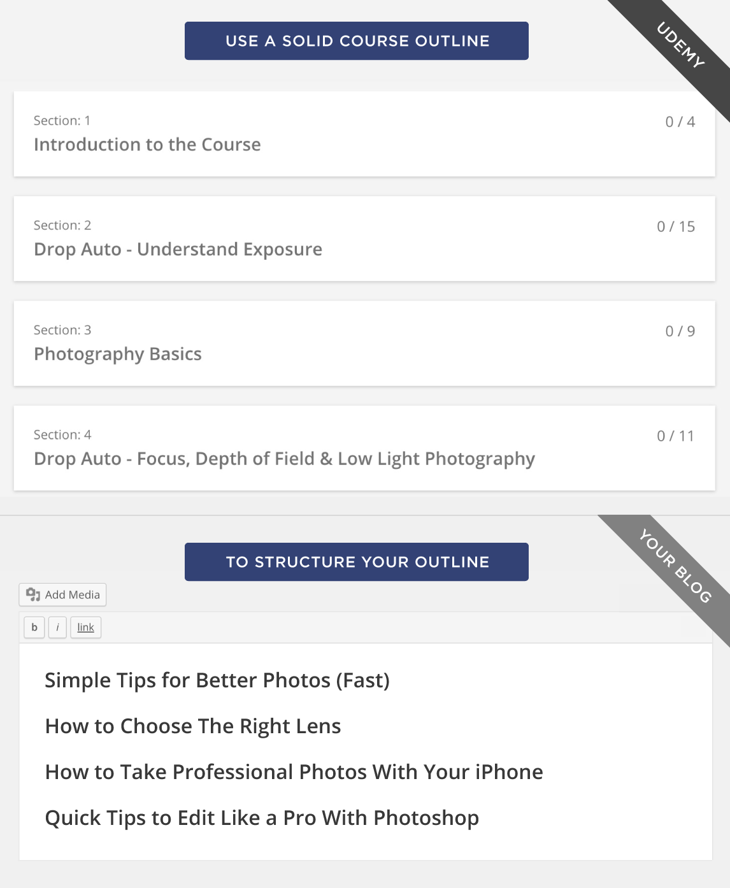
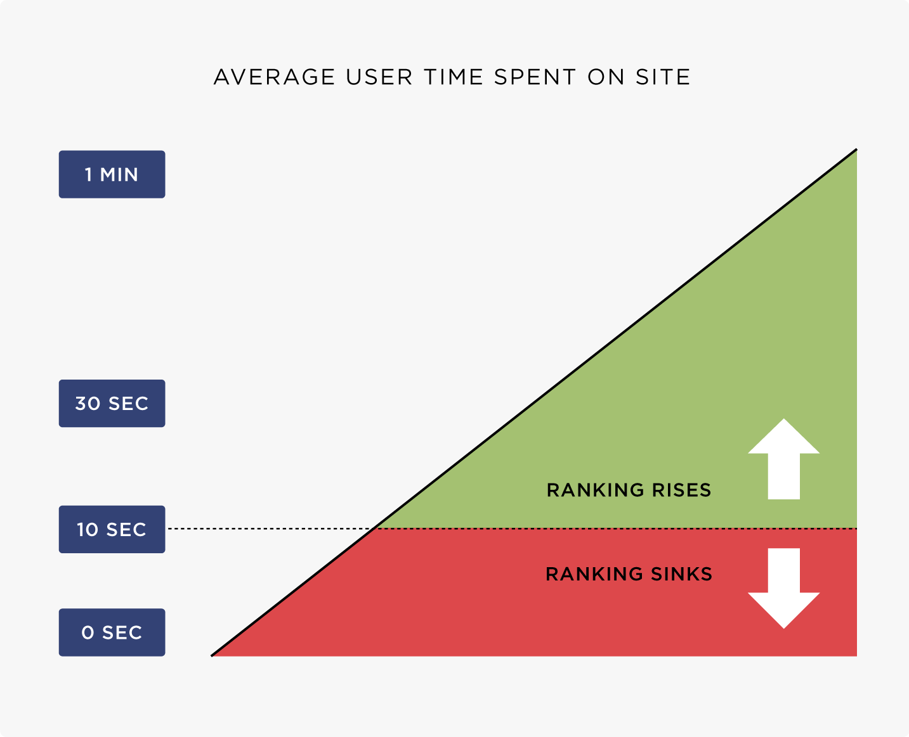
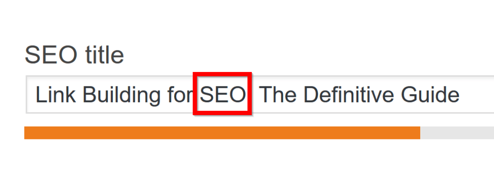
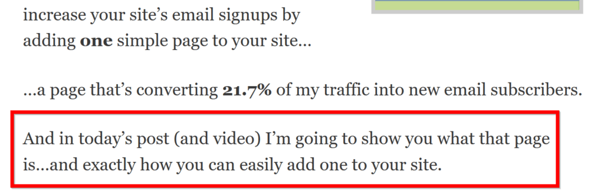

# Growth Hacking

## SEO
### SEO内容创作：17个超级秘密

原文：[SEO Copywriting: 17 Powerful Secrets (Updated for 2017)](http://backlinko.com/seo-copywriting)

翻译：[hubwiz.com](http://www.hubwiz.com) 2017.8.24

#### 概述

会`SEO`很棒。

会内容创作也很棒。

不过如果你两样都会呢？

你可以拍胸脯了...

...因为你将是不可阻挡的。

今天，我会讲一些东西，能让你感觉自己具有了`SEO`的超能力：

__17个立马可用、超级可行的SEO内容创作技巧。__

__注意__：这个帖子最早在2015年发表。我最近进行了更新，
也加入了一些我最近学到的新的技巧。

享受吧！

#### 1# 利用Udemy让你的内容更有竞争力

你看：

大多数人认为SEO内容创作是把关键词拼在一起。

不过在我的经历中，你的内容的结构和写作本身一样重要。

有比Udemy更好的地方，能找到验证过的内容结构吗？

（如果你还不熟悉Udemy，它是一个在线课程的大型目录）

__这是你如何使用Udemy让你的内容具有3倍竞争力的方法：__

首先，到Udemy输入一个关键词。

例如，假设你正在写一篇关于摄影的博客。你会搜索`photography`：

Udemy会列出来他们热门的照相课程：

接下来，选一门有很多评论的课程。

这是一个：

一旦你选中一门课程，看一下多少人已经报名了。

就像你看到的，超过70000人已经学习了这门摄影课：

你知道这是多大的数量吗？

你在看的内容，有超过 __70000人已经掏钱学习了__ 。

这意味着你不需要依赖于你的感觉。你知道存在着对你的内容的
需求。

成千上万的人已经投票了...使用他们的钱包。

__现在：__

一旦你找到了一门热门课程，向下滚动到 __大纲__ 段落。

在这儿你将找到经过验证的内容结构，你可以用于你的下一篇博客、
视频或信息图：

显然，你不会想着把课程内容扒下来。

不过你的结构，可以借鉴课程大纲的点点滴滴：

现在，你有了自己的内容轮廓，几乎到了要提笔写字的时候了。

不过，在写之前，还是先读完接下来的技巧...

#### 2# 添加转换语来降低跳出率

当人们从搜索引擎登陆你的网站时，可能会发生两件事：

他们要么立刻离开...

...要么停在你这里。

当人们粘在你的页面时，Google就会认为：

“这是一个很棒的网页，让我给它提升一下排名。"

不过当人们就像逃离沉船一样，飞快地离开你的网站时...

就是Google像扔石头一样抛弃你的网站的时候。

基本原则？

如果你想要更高的排名，你需要把人们留在你的站上。

如何做到？`Bucket Brigades`。

`Bucket Brigades`就是那些 __把人们留在你的站上的__ 
单词和短语。

例如：

你可能注意到我倾向于使用以冒号结尾的短句，就像这个：

这就是个`Bucket Brigade`。

__但是到底什么是`Bucket Brigades`？__

`Bucket Brigades`是一个老式的内容创作技巧，它的目的是
使写出来的推销信件，能让人读的下去。

我已经在`SEO`内容中使用了`Bucket Brigades`，结果，相当
疯狂。

事实上，这是Backlinko的平均停留时间：

是的，4分钟。

这么长的停留时间，很大一部分原因在于我用`Bucket Brigades`
点缀每一个帖子。

__现在是时候给你展示如何使用`Bucket Brigades`来提高停留时间了__

首先，在你的内容中，找到一个人们可能点击浏览器`back`按钮的
地方...

...添加一个`Bucket Brigade`。

开始你的介绍。

这是一个示例，在介绍里，我使用了两个`Bucket Brigades`：

（顺便说一下，那个帖子的平均停留时间超过5分钟）

你也可以在内容的中间部分使用`Bucket Brigades`。

这是一个来自我最近一个帖子的示例：

基本原则：任何时候，当你有一个地方，你感觉人们可能会厌倦离开，
你就加上一个`Bucket Brigade`。

你可以制造自己的`Bucket Brigade`... 或者使用这些经过验证的
经典的`Bucket Brigade`：

- 情况是这样：
-  现在：
- 基本原则是什么？
- 你可能会想：
- 这真疯狂：
- 好一点：
- 想知道最好的部分？

现在，搞定了。

#### 3# 使用相关词迎合搜索引擎

今天，已经超级聪明的Google不再关心，你在文章中重复了多少遍
关键词。

相反，它更关注 __LSI（潜在语义索引）__ 关键字。

（`LSI`关键字就是近义词、相关词的一个更炫的说法）

__这些LSI关键词帮助Google理解你的页面。__

例如，假设你写了一篇文章，围绕关键字`cars`进行优化。

Google怎么知道你的页面是关于：

- 车辆
- 电影`Cars`
- 1970年代的一个摇滚乐队`cars`
- 加拿大航空管制局`CARs`

答案？在于`LSI`关键词。

例如，当Google看到一个具有这样的关键词的页面...

...它就知道这个页面是关于车辆的。

不过当Google看到一个这样的页面...

...它就知道页面是关于电影`Cars`的。

那么，你怎么才能把更多的`LSI`关键词添加到你的内容里呢？

__让我用一个示例来解释：__

假设你的关键词是`playstation RPGs`。

首先，在Google里搜索那个关键词：

然后，注意页面中那些 __不是你输入的关键词的__ 粗体的单词和
短语。

这是摘自Google结果第一页的一些示例：

看到Google是如何加粗像`Final Fantasy VIII`和`PS1`这样的
单词了吗？

这意味着Google认为这些词条和你输入的关键词非常相似。

（换句话说，这些是`LSI`关键词）

最后，用这些粗体词条点缀你的内容...

...你可以继续前进尝试下一个秘密武器了。

#### 4# 用这个秘密技巧排名Google第一

胆大包天的承诺？绝对是。

不过别走开。

我要谈的大秘密是什么？

__创造你自己的关键词__

让我解释一下。

如果在Google里搜索你自己的品牌，你可能会排名第一：

你可能没想过这个，__你的品牌是一个关键词__...

...一个你会自动排名第一的关键词。

但是为什么就此止步？

当你为技巧和策略也打造品牌时，你可以获得更多的自然搜索流量。

例如：
你可能听说过`Skyscraper`技巧，我发明的让你获得更多
自然搜索流量的三步操作法。

因为我为方法造了个名字`The Skyscraper Technique`，现在每天
都能获得额外的流量。

实际上，根据Google搜索控制台的显示，关键词`Skyscraper
Technique`每个月可以获得1093个搜索来访者：

因为我在这个关键字上排名第一（也出现在回答框里），我得到了这个关键词
的绝大多数点击（1103里的1093个）：

基本原则？

任何时候，当你开发出一种独特的策略或技巧...

... __确保你给它起了一个名字。__

如果你这样做了，你将得到额外的自然搜索流量。

#### 5# 到论坛去寻找你的用户会用的词

不久前我发表了一个帖子，名字叫：
`Why Google Hates Your Site (Hint: It Has Something to Do With TrustRank)“:`：

在这个帖子里，我决定使用一个我的竞争对手压根就
不会用的关键词...

...即使这样，这个词还是带来了可观的搜索流量。

关键词是什么？

__Google hates my site（Google讨厌我的站）__

信不信由你，我不是凭空捏造的这个词。

我选择这个关键词，是因为我看到，在SEO论坛里很多人
说着类似的话：

如果人们在论坛里发帖谈论一个东西，你可以确信他们也会
在Google里搜索同样的东西。

于是我决定在我的帖子里使用这个关键词的一个变种：

现在，我的目标关键词`Google TrustRank`已经排名第一...

...当人们搜索`Google hates my site`时，我的帖子会显示在
最高的位置：

你如何使用这个技巧获取更多流量？

首先，像往常一样[优化页面](http://backlinko.com/on-page-seo)。.。

但是，在你点击`发布`之前，逛一下论坛，看看对于你选中的主题，
人们通常使用什么单词和短语。

例如，假设你的基本关键词是`organic vegetable gardening`。

你可以在Google里这样搜索：`inurl:forum + "organic vegetable gardening"`

这会找出了一堆关于这个主题的论坛帖子：

跳过结果中最初的几个。

当你看到一个看起来不错的短语时...

...在Google里搜索那个短语：

如果结果页面的数量很多（就像这个例子），就把这些词和短语
加到你的内容里。

好了。

#### 6# 如何让你的内容被更多地分享

情况是这样：

当然，社交分享按钮帮助你获得更多的分享...

...但是大多时候，__只有这些按钮是不够的。__

相反，我推荐深入探索内容创作者最好的帮手：

__行为召唤。__

让我解释一下。

几个月之前，我发表了`17 Insanely Actionable 
List Building Strategies That Will Generate 
More Subscribers Today`：

为了让这个帖子获得尽可能多的分享，我在列表中每一项
的下面，添加了一个`click to tweet`按钮：

到今天位置，我的帖子获得了超过2900个`tweets`...

...而且这2900个`tweets`中的一大部分都来自我的
`click to tweets`按钮：

让我告诉你怎么实现：

首先，从你的帖子里找出一个超级可行的小窍门或者方法。

接下来，去`ClickToTweet.com`，点击`basic link`：

把你的小窍门转换成一个`tweet`：

然后，点击`Generate new link`：

拿到链接...

...把链接塞到你的帖子里。

你可以像我一样使用按钮。不过普通文字链接效果也很好：

#### 7# 即使没有高排名也能获得更多搜索流量

这是我们都能认同的：

你的排名越高，你的点击越多，对吗？

嗯...不一定。

结果表明你能获得更多的搜索流量...即使没有较高的排名。

点击`play`了解这个强大的策略是如何运作的：

<iframe width="582" height="327" src="https://www.youtube.com/embed/L_6zAGJ-JO4" frameborder="0" allowfullscreen></iframe>

#### 8# 解析亚马逊为电子商务引流

由于像亚马逊这样的巨头霸占着搜索结果的首页，对
一个电商网站来讲，想要进行有效的`SEO`并不容易。

不过，我还是看到一些小的电商网站战胜了巨头。

他们的秘密是什么？

__他们使用了绝大多数竞争者都不知道的长尾关键词。__

这是他们的手法（你也做得到）：

首先，搜索一个你在亚马逊上卖的产品。

例如，假设你开了一个卖有机狗粮的电商网站。

你将在亚马逊上搜索`organic dog food`：

但是，别按回车键！

如果你等一秒钟，亚马逊会展示出，和你的输入相关的
长尾关键词（就像`Google Suggest`）：

抓几个这样的词，丢到Google里：

验证一下这个长尾关键词，是不是比你的目标关键词竞争
难度小一些。

通常会是：

（从上图你可以看出，关键词`Organic Dog Food`搜索结果`top 10`的结果
页面权威性比类似的长尾词要高`X%`）

由于亚马逊给出的建议关键词是`激光制导`的，目标用户非常精确，因此
这些词的转化率都很高。

最后，把这些关键词点缀在你的商品和目录页（以及标题和描述`tag`）

当你把这些长尾词添加到产品和目录页以后，就可以使用下一个技巧。

#### 9# 使用标题修饰关键词获得更多长尾流量

如果你想用长尾词获得更多流量，方案很简单：

__在标题`tag`中添加修饰词__

什么是修饰词？

修饰词就是那些你添加到标题`tag`中的单词...

...那些让你的网站出现在长尾搜索者面前的词。

__这有一个实战小案例：__

不久前我发表了一个指南：“Link Building: The 
Definitive Guide”。

我使用的标题`tag`，就是指南的名字：

那时，我自己想：

这个标题`tag`又短又贴切，它也包含了我的目标关键词。
这是一个很棒的标题`tag`。

__但是我错了。__

我很快意识到，如果我加一个修饰词，本可以获得更多流量。

于是我在标题`tag`里，加了一个关键词`SEO`：

多亏这个简单的调整，我的页面在我压根没有考虑优化的一些
关键字上，也有了排名...

...就像`SEO link building`（590个搜索/每月）：

像`link building SEO`（90个搜索/月）：

根据`GWT`的统计，这两个关键字每个月给我带来了 __139个目标
用户。__

所有这些，理论上讲都来自那28秒的一个改动。

你如何做到这一点？

首先，找到你站上的一个具有短标题`tag`的页面（25-40个字母）。

然后从这个清单中挑一个两个修饰词加到标题`tag`里：

- 如何...
- 今年
- 回顾
- 最好
- 最快
- 检查清单
- 指南
- 小窍门
- 容易
- 简单

你没法精确地预测这些修饰词能带来的关键词...

...但是你将获得更多的搜索流量。

这才是最重要的。

#### 10# 延长用户的停留时间

就像你早前看到的，Backlinko在页面平均停留时长方面超过
平均水准：

 

我已经告诉过你，`Bucket Brigade`是留住用户一个重要方面。

现在，我要展示给你另一个技巧，能让Google搜索者粘到你的
网站上，就像胶沾上一样：

__经过实战考验的、帖子介绍部分的结构。__

今天，我要分享一个我最喜欢的手段：

`APP`方法。

它的基本构成如下：

从图中容易看出，`APP`表示：`Agree`（认同）、`Promise`（承诺），
和`Preview`（预览）。

让我们拆开来看：

__首先，我们需要认同__。

从Google搜索者会认同的一个想法或概念开始你的介绍。

这展示给他们，你理解他们的问题。

这是一个例子，来自我的一个帖子：

这里说的都是那些从关键词“squeeze page”搜索过来的人们
认同的东西。

__现在你已经让他们点头了，是时候给出承诺了__。

承诺部分就是你给他们展示更好的方案的地方。

这是一个示例，来自我的帖子“Social Squeeze Page Post”：

__最后，用预览打动他们__

不要绕圈子，直接说你能给他们什么。

一旦完成预览部分，你就准备好了。

现在你有了一个能让Google搜索者停留在你站上的介绍部分...

...以及一个Google乐于展示给更多人的页面。

#### 11# 使用相关搜索获得更多语义相关词

记住：

就像我在第3节提到的 —— 你在内容中嵌入越多的LSI关键词 ——
Google就越能理解你的页面。

现在我有一个小实例，可以展示给你如何找出比你想要的还多
的LSI关键词。

不久前我想给帖子加一些LSI关键词，”On-Page SEO: Anatomy 
of a Perfectly Optimized Page“。

首先，我在Google搜索我的目标关键词（"on page SEO"）:

接下来，我滚动到页面底部。Google在这里展示和你搜索相关的
关键词：

这些是可以用在你的内容中的完美的LSI关键词。

我提取任何我觉得有用的LSI关键词，把它们塞到我的内容里。

例如：

好了。

这个技巧有一个额外的有点：

相关搜索词帮助你选择Google Keyword Planner不显示的长尾
关键词：

这意味着会带给你更多流量。

#### 12# 向BuzzFeed学习如何炮制标题

有意思：

许多内容营销人员讨厌[buzzfeed](http://buzzfeed.com/)
这样”骗点击“的网站。

我？__我认为他们是天才__。

他们用飞快增长证明了自己...

真的。Buzzfeed.com从零到美国`top 50`的网站...实际上是
一夜之间。

此外，你很难不喜欢这样的头条：

而且他们已经证明了他们的标题炮制公式的确能夺人眼球。

例如，这个标题可能已经吸引了你：

这个副标题的灵感就来自于BuzzFeed的一个帖子：

你也可以做到。

只要看看BuzzFeed和其他一些骗点击的网站上最近的帖子：

...然后把它们运用到你自己的文章标题和副标题上。

显然，有些标题有点过了。

因此我整理了一些Buzzfeed风格的可以吸引注意力的标题模板...
而且不会太夸张：

- 25 个会改变你（）的（）
- 我试着（），效果令人意外
- 这个（）让（）好10倍
- 这是11（）可以（），科学已经证实！
- 使用这20个简单技巧来获得更多（），第5个超赞！
- 当你掌握（），你绝不会再（）

#### 13# 使用keyworkddit解开隐藏的关键词

你用Reddit做关键词搜索吗？

如果没有的话，你应该试试。

毕竟，Reddit的用户讨论地球上的每一个主题...从烤箱
到三脚架。

这个方法只有一个问题：

__梳理Reddit巨痛苦__

输入：[keyworddit](http://www.keyworddit.com/)。

Keyworddit会帮你做这些梳理工作。

只要选择一个子范畴...

...你会看到人们讨论你的主题时用到的词条：

相当酷。

#### 14# 如何避免你的内容被读者忽视

每个人，以及他们的妈妈，都知道副标题让在线内容更容易阅读。

为了展示副标题的作用有多大，这里有一个示例：

如果你还是个人，你就会倾向左边这个。

现在：

副标题只是分解你的内容的一个办法。

杂志使用成打的技术来分解文本内容。

这里是来自Inc.杂志的一个例子，我把它摊在了我的公寓地板上：

我将展示给你三个受杂志启发的文本分解技术，当你用上以后，就
会大大增强你的内容的易读性。

__1：使用引用框__

当你引用某人说的话时，把那个引用放在一个框里。这是来自Backlinko
的一个例子：

__2:使用标注框__

这是另一种杂志主题。

任何时候如果你有一些补充性的内容，把它放在标注框里。

Backlinko使用了很多这种技巧。

__3.区块横幅__

这个技巧有点复杂...

...不过它会让你的内容开起来超级专业。

其实也就是在每个副标题下面加一个定制的横幅，就像这个：

现在看起来得多棒！

你可以通过诸如Upwork这样的网站雇人来制作这些横幅。

或者，如果你有心情DIY，不妨试试[Canva](https://www.canva.com/)。

#### 15# 使用短网址提高点击通过率和排名

短网址真的能帮助提高在Google中的排名吗？

我们对搜索引擎排名的影响因素的研究表明，在网址长短和
Google排名之间存在显著的相关性。

问题是：为什么较短的URL会在Google中得到较高的排名？

__首先，短网址让Google处理起来更容易__。

你知道，Google使用你的网址来理解你的网页内容。

这就是为什么像这样的网址：

`www.website.com/your-keyword`

好过这样的网址：

`www.website.com/12/15/2017/your-keyword-and-why-it-is-important`

__其次，短网址=较好的点击通过率__

数据可以证实这一点：
- Marketing Sherpa的研究表明，短网址获得250%的点击
- 微软发现描述性的网址能够提高点击通过率大约25%

考虑一下，这有点意思...

网址是关于你页面主题的一个高层次的总结。

不过如果你的网址有一英里长，使用Google的用户就会跳过它
而点击另一个搜索结果。

__实际上，Google讨厌长的网址，他们现在会在搜索结果中
自动把长网址重写为短网址__：

这就是为什么我推荐简单但是具有描述性的网址，就像这个：

小提醒：你的网址真的长吗？我不会建议你去改它们，只要在以后
应用这个规则就行了。

#### 16# 如何使用一个小技巧让流量提升71.6%

去年，Dave Attard碰到了一个问题...

他花了很多时间，创作了这个令人印象深刻的`web`设计检查清单：

这个指南写的很好，以致于目标关键词排名达到了`Top 3`。

不幸的是，这个`top-3`排名并没有像David预期的那样带来足够多
的搜索流量。

这时，他意识到，他本应使用一个 __更好的标题`tag`__ 来提升流量。

最初的标题`tag`也不错...不过还有相当大的提升空间：

他在两方面进行了改进：

__首先，他加了一个数字__。

内容创作者已经了解这一点很多年了：__数字=点击__。

这就是为什么David在标题里加了一个数字。

David还为标题添加了一些感情色彩。研究表明
[感情强烈的标题能获得更多的点击](http://arxiv.org/pdf/1503.07921v2.pdf)。

这就是为什么David在标题`tag`中加入了单词"Amazing"：

结果如何？

自然搜索流量增长了71.6%。

相当酷，对吧？

#### 17. 使用Bloomberry找到长尾关键词

想找到竞争对手不知道的长尾关键词？

没有比 [Bloomberry](http://bloomberry.com/)更好的选择了。

它的使用方法如下：

在工具中输入一个种子关键词：

然后`Bloomberry`就会从互联网上围绕你的关键词查找问题和主题：

因为大多数问题和主题都不包含你的种子关键词，所以你的竞争对手
根本就不了解它们。

一座金矿。

